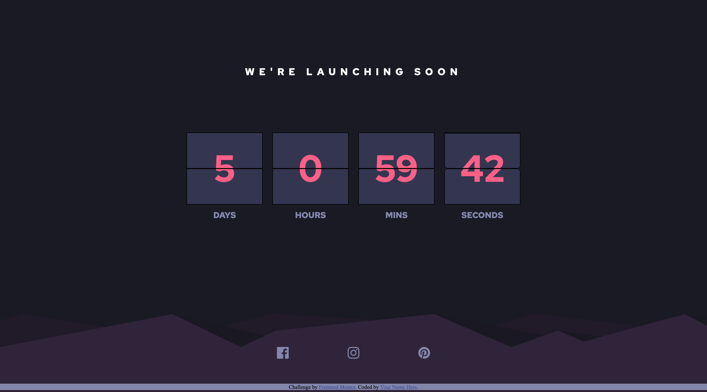

# Frontend Mentor - Launch countdown timer solution

### The challenge

Users should be able to:

- See hover states for all interactive elements on the page
- See a live countdown timer that ticks down every second (start the count at 14 days)
- **Bonus**: When a number changes, make the card flip from the middle

### Screenshot

### Links

- Solution URL: [https://github.com/Richard2957/launch-countdown-timer-main/settings/pages](https://github.com/Richard2957/launch-countdown-timer-main/settings/pages)
- Live Site URL: [https://richard2957.github.io/launch-countdown-timer-main/](https://richard2957.github.io/launch-countdown-timer-main/)

### Built with

Vanilla CSS and JS

### What I learned

Was fun getting the number rollover to work.

## Author

- Frontend Mentor - [@richard2957](https://www.frontendmentor.io/profile/richard2957)
- Twitter - [@richard2957](https://www.twitter.com/richard2957)
